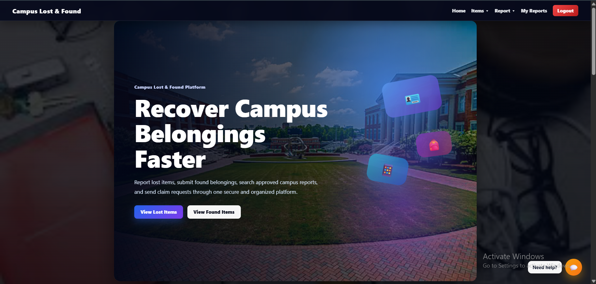
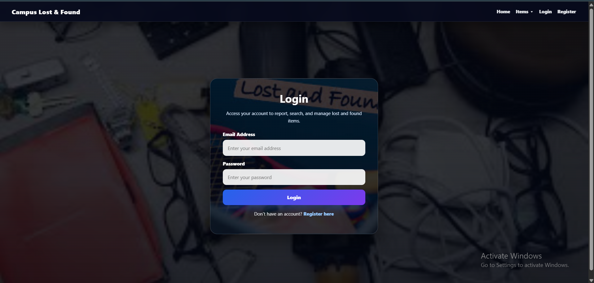
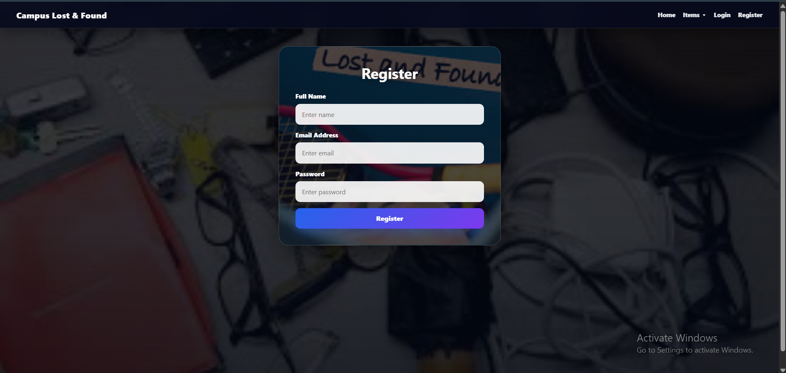
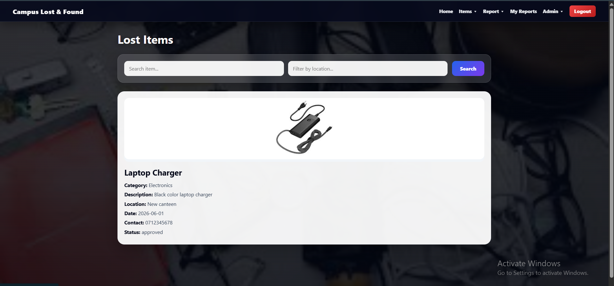
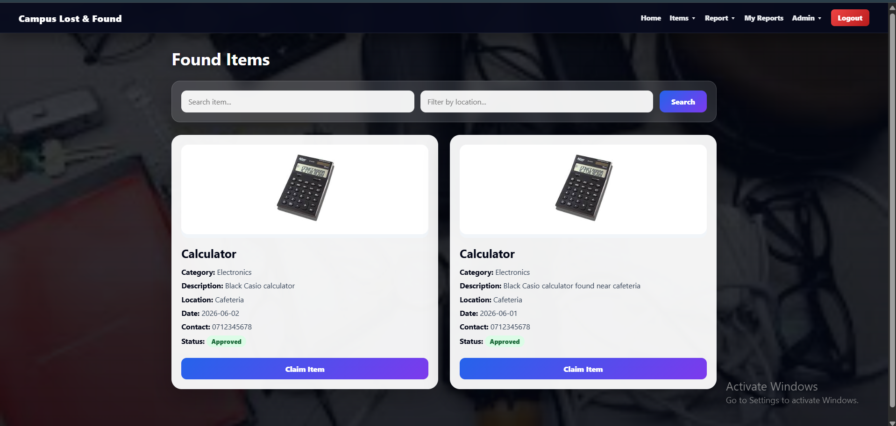

# Campus Lost and Found Management System

A full-stack web application developed to help students report lost items, submit found items, search belongings, and send claim requests within a campus environment.

This project includes user authentication, item reporting, image uploads, admin approval, claim management, search and filter options, and a modern responsive user interface.

---

## Project Overview

Students often lose personal belongings such as ID cards, calculators, chargers, books, bags, and phones inside the campus. Normally, these items are reported through notice boards, WhatsApp groups, or verbal communication, which can be unorganized and difficult to track.

The Campus Lost and Found Management System provides a centralized platform where:

- Students can report lost items
- Students can submit found items
- Users can search approved lost and found reports
- Users can claim found items with proof
- Admins can approve, reject, resolve, and manage reports
- Admins can review and manage claim requests

---

## Main Features

### User Features

- User registration and login
- JWT-based authentication
- Report lost items
- Report found items
- Upload item images
- View approved lost items
- View approved found items
- Search and filter items by name and location
- Send claim requests for found items
- View personal reports through My Reports page

### Admin Features

- Admin dashboard with report counts
- View all lost and found reports
- Approve, reject, resolve, and delete reports
- View claim requests
- Approve or reject claim requests
- Role-based admin access control

---

## Technologies Used

### Frontend

- React
- Vite
- React Router DOM
- Axios
- CSS

### Backend

- Node.js
- Express.js
- MongoDB
- Mongoose
- JWT Authentication
- Multer for image upload
- Bcrypt.js for password hashing

### Database

- MongoDB Atlas

---

## Project Structure

```text
campus-lost-found-system/
│
├── backend/
│   ├── controllers/
│   ├── middleware/
│   ├── models/
│   ├── routes/
│   ├── uploads/
│   ├── .env
│   ├── server.js
│   └── package.json
│
├── frontend/
│   ├── public/
│   │   ├── images/
│   │   └── screenshots/
│   ├── src/
│   │   ├── api/
│   │   ├── components/
│   │   ├── pages/
│   │   ├── App.jsx
│   │   └── index.css
│   └── package.json
│
└── README.md
```
---

### Pages

-Home
-Login
-Register
-Lost Items
-Found Items
-Report Lost Item
-Report Found Item
-My Reports
-Admin Dashboard
-Manage Reports
-Manage Claims

---

## Key Functional Flow

1. User registers or logs in to the system.
2. User reports a lost or found item.
3. The report is saved with a pending status.
4. Admin reviews the submitted report.
5. Admin approves, rejects, or resolves the report.
6. Approved reports appear on the public Lost Items and Found Items pages.
7. User sends a claim request for a found item.
8. Admin reviews the claim request.
9. Admin approves or rejects the claim.

---

## Security Features

- Password hashing using Bcrypt.js
- JWT-based authentication
- Protected routes for logged-in users
- Admin-only access control
- Image upload validation

---

## API Endpoints

### Auth Routes

| Method | Endpoint | Description |
|--------|----------|-------------|
| POST | `/api/auth/register` | Register user |
| POST | `/api/auth/login` | Login user |

---

### Lost Item Routes

| Method | Endpoint | Description |
|--------|----------|-------------|
| POST | `/api/lost-items` | Create lost item report |
| GET | `/api/lost-items` | Get approved lost items |
| GET | `/api/lost-items/my-reports` | Get logged-in user's lost reports |
| GET | `/api/lost-items/:id` | Get lost item by ID |
| PUT | `/api/lost-items/:id` | Update lost item |
| DELETE | `/api/lost-items/:id` | Delete lost item |

---

### Found Item Routes

| Method | Endpoint | Description |
|--------|----------|-------------|
| POST | `/api/found-items` | Create found item report |
| GET | `/api/found-items` | Get approved found items |
| GET | `/api/found-items/my-reports` | Get logged-in user's found reports |
| GET | `/api/found-items/:id` | Get found item by ID |
| PUT | `/api/found-items/:id` | Update found item |
| DELETE | `/api/found-items/:id` | Delete found item |

---

### Claim Routes

| Method | Endpoint | Description |
|--------|----------|-------------|
| POST | `/api/claims` | Send claim request |
| GET | `/api/claims/my-claims` | Get user's claim requests |
| GET | `/api/claims` | Admin get all claims |
| PUT | `/api/claims/:id/status` | Admin update claim status |

---

### Admin Routes

| Method | Endpoint | Description |
|--------|----------|-------------|
| GET | `/api/admin/dashboard` | Get dashboard statistics |
| GET | `/api/admin/reports` | Get all lost and found reports |
| PUT | `/api/admin/lost-items/:id/status` | Update lost item status |
| PUT | `/api/admin/found-items/:id/status` | Update found item status |
| DELETE | `/api/admin/lost-items/:id` | Delete lost item |
| DELETE | `/api/admin/found-items/:id` | Delete found item |

---

## Screenshots

### Home Page


### Login Page


### Register Page


### Lost Items Page


### Found Items Page


### Report Lost Item Page


---

## Installation and Setup

1. Clone the repository

```bash
git clone https://github.com/your-username/campus-lost-found-system.git
cd campus-lost-found-system
```
---

## Backend Setup

2. Go to backend folder

```bash
cd backend
```

3. Install backend dependencies

```bash
npm install
```

4. Create .env file inside backend folder

```env
PORT=5000
MONGO_URI=your_mongodb_connection_string
JWT_SECRET=your_jwt_secret
```
5. Run backend server

```bash
npm run dev
```

Backend runs on:

```bash
http://localhost:5000
```

---

## Frontend Setup

6. Go to frontend folder

```bash
cd frontend
```

7. Install frontend dependencies

```bash
npm install
```

8. Run frontend

```bash
npm run dev
```

Frontend runs on:

```bash
http://localhost:5173
```
---

## Author

**Amanda Gangamini**  
BSc (Hons) in Information Technology  
Specialization: Artificial Intelligence  
SLIIT
---